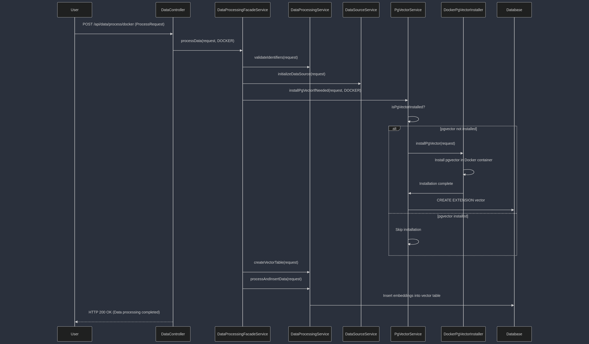
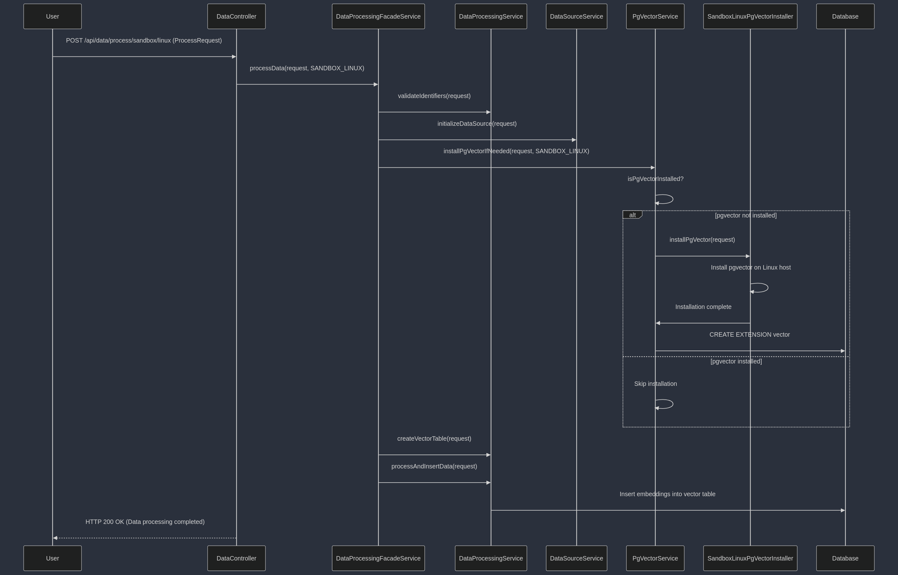
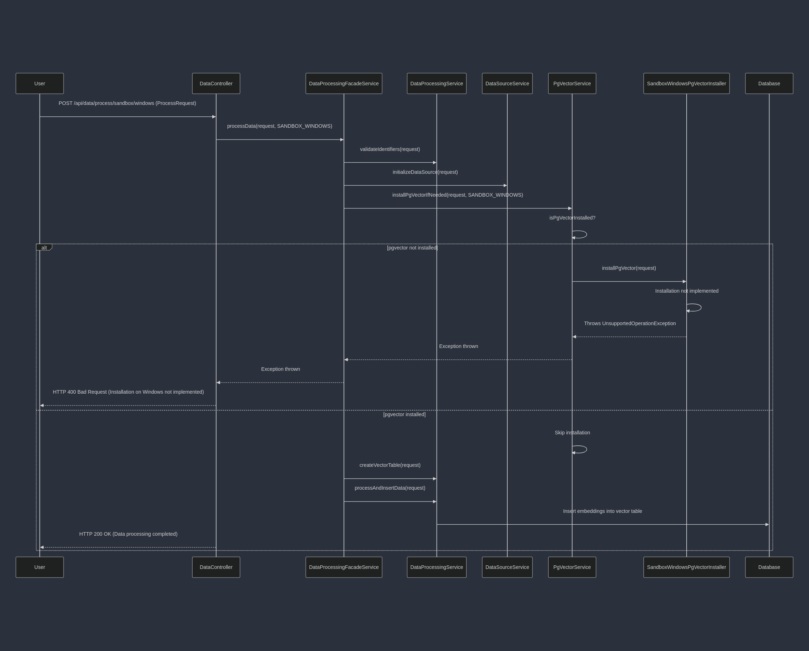

# Data Processing Service with `pgvector` Installation

## Table of Contents

1. [Introduction](#introduction)
2. [Functionalities](#functionalities)
    - [Overview](#overview)
    - [Key Components](#key-components)
3. [Challenges](#challenges)
4. [Important Notes](#important-notes)
5. [Sequence Diagrams](#sequence-diagrams)
    - [Docker Environment](#docker-environment)
    - [Sandbox Linux Environment](#sandbox-linux-environment)
    - [Sandbox Windows Environment](#sandbox-windows-environment)
6. [Conclusion](#conclusion)

---

## Introduction

This documentation provides a comprehensive overview of the data processing service that automates the installation of the `pgvector` extension in a PostgreSQL database, processes data, and inserts embeddings into a vector table. The service is designed to handle different environments, including Docker, sandbox Linux, and sandbox Windows, using the Strategy design pattern for flexibility and scalability.

---

## Functionalities

### Overview

The data processing service is responsible for:

- **Initializing Database Connection**: Establishing a connection to the database using the provided credentials and JDBC URL.
- **Detecting Database Dialect**: Identifying the type of database (e.g., PostgreSQL, MySQL) to tailor SQL queries accordingly.
- **Validating Identifiers**: Ensuring that table names, field names, and other identifiers are valid and safe to use in SQL statements.
- **Installing `pgvector` Extension**: Automating the installation of the `pgvector` extension in the database environment if it's not already installed.
- **Creating Vector Table**: Creating a new table to store embeddings, tailored to the database dialect.
- **Processing Data**: Reading data from the specified table and fields, generating embeddings, and inserting them into the vector table.

### Key Components

#### 1. `EnvironmentType` Enum

Defines the possible environments where the service can operate:

- `DOCKER`: The database is running inside a Docker container.
- `SANDBOX_LINUX`: The database is running on a Linux host machine.
- `SANDBOX_WINDOWS`: The database is running on a Windows host machine.

#### 2. Strategy Pattern with `PgVectorInstaller` Interface

Implements the Strategy design pattern to handle different environments:

- **Interface**: `PgVectorInstaller` defines the method `installPgVector(ProcessRequest request)`.
- **Concrete Implementations**:
    - `DockerPgVectorInstaller`: Installs `pgvector` in a Docker environment.
    - `SandboxLinuxPgVectorInstaller`: Installs `pgvector` on a Linux host machine.
    - `SandboxWindowsPgVectorInstaller`: Placeholder for Windows installation.

#### 3. Services

- **`DataSourceService`**: Manages database connections and configurations.
- **`PgVectorService`**: Manages the installation of the `pgvector` extension using the appropriate strategy.
- **`DataProcessingService`**: Handles data validation, table creation, data processing, and insertion of embeddings.
- **`DataProcessingFacadeService`**: Serves as a facade to orchestrate the processing flow based on the environment.
- **`DockerService`**: Provides utility methods for interacting with Docker containers.

#### 4. Controller

- **`DataController`**: Exposes RESTful endpoints to initiate data processing for different environments.

#### 5. Models and Requests

- **`ProcessRequest`**: Contains all necessary data for processing, including database credentials, table names, fields, and Docker container name (if applicable).

---

## Challenges

### 1. Environment Diversity

- **Different Operating Systems**: Handling installation procedures for various Linux distributions and Windows.
- **Docker vs. Host Environments**: Managing installations inside Docker containers versus directly on the host machine.

### 2. `pgvector` Installation Automation

- **Permissions**: Requiring appropriate permissions to execute shell commands and Docker commands.
- **Security Risks**: Executing shell commands from Java can pose security vulnerabilities.
- **Unsupported Environments**: Windows installation is more complex and may require manual intervention.

### 3. Database Dialect Handling

- **SQL Variations**: Different databases have varying SQL syntax and data types.
- **Extension Support**: Not all databases support extensions like `pgvector`.

### 4. Data Processing

- **Large Data Sets**: Processing millions of records efficiently.
- **Embedding Generation**: Integrating with embedding generation libraries or services.

### 5. Error Handling and Logging

- **Robustness**: Providing meaningful error messages and handling exceptions gracefully.
- **Debugging**: Logging outputs and errors for troubleshooting.

---

## Important Notes

### 1. Security Considerations

- **Shell Command Execution**: Ensure that the application runs in a secure environment and that all inputs are sanitized.
- **Permissions**: The application must have necessary permissions to execute Docker and `sudo` commands.
- **Credential Management**: Handle database credentials securely, avoiding hardcoding sensitive information.

### 2. Maintainability

- **Modular Design**: Using the Strategy pattern allows for easy addition of new environments or installers.
- **Code Separation**: Separating concerns across different services improves readability and maintainability.

### 3. Extensibility

- **Adding New Environments**: Implementing a new `PgVectorInstaller` for additional environments is straightforward.
- **Database Support**: The service can be extended to support additional databases by updating dialect mappings and SQL generation methods.

### 4. Error Handling

- **Exceptions**: The services throw exceptions with informative messages to aid in debugging.
- **HTTP Responses**: The controller returns appropriate HTTP status codes and messages based on the operation outcome.

### 5. Logging

- **Info Logs**: Informational messages to track the application's flow.
- **Error Logs**: Detailed error messages to assist in diagnosing issues.

---

## Sequence Diagrams

The following sequence diagrams illustrate the interactions between components for each environment.

### Legend

- **Actors**:
    - **User**: Initiates the data processing request via an API call.
- **Components**:
    - **DataController**
    - **DataProcessingFacadeService**
    - **PgVectorService**
    - **PgVectorInstaller** (Strategy Interface)
    - **Concrete Installers**: `DockerPgVectorInstaller`, `SandboxLinuxPgVectorInstaller`, `SandboxWindowsPgVectorInstaller`
    - **DataProcessingService**
    - **DataSourceService**
    - **Database**

### 1. Docker Environment

**Sequence Diagram**:

**Description**:

1. **User** sends a request to `/api/data/process/docker` with `ProcessRequest`.
2. **DataController** receives the request and calls `DataProcessingFacadeService.processData(request, EnvironmentType.DOCKER)`.
3. **DataProcessingFacadeService** performs:
    - Validates identifiers via `DataProcessingService`.
    - Initializes the data source via `DataSourceService`.
    - Calls `PgVectorService.installPgVectorIfNeeded(request, EnvironmentType.DOCKER)`.
4. **PgVectorService** checks if `pgvector` is installed.
    - If not installed, selects `DockerPgVectorInstaller` from the strategy map.
    - Calls `DockerPgVectorInstaller.installPgVector(request)`.
        - Executes Docker commands to install `pgvector` inside the container.
5. **PgVectorService** enables `pgvector` extension in the database.
6. **DataProcessingFacadeService** continues:
    - Creates the vector table via `DataProcessingService`.
    - Processes and inserts data via `DataProcessingService`.
7. **DataController** returns a success response to the **User**.

### 2. Sandbox Linux Environment

**Sequence Diagram**:

**Description**:

1. **User** sends a request to `/api/data/process/sandbox/linux` with `ProcessRequest`.
2. **DataController** receives the request and calls `DataProcessingFacadeService.processData(request, EnvironmentType.SANDBOX_LINUX)`.
3. **DataProcessingFacadeService** performs similar steps as in the Docker environment.
4. **PgVectorService** selects `SandboxLinuxPgVectorInstaller` for installation.
    - Executes shell commands to install `pgvector` on the host Linux system.
5. The rest of the process continues as in the Docker environment.

### 3. Sandbox Windows Environment

**Sequence Diagram**:

**Description**:

1. **User** sends a request to `/api/data/process/sandbox/windows` with `ProcessRequest`.
2. **DataController** receives the request and calls `DataProcessingFacadeService.processData(request, EnvironmentType.SANDBOX_WINDOWS)`.
3. **PgVectorService** selects `SandboxWindowsPgVectorInstaller` for installation.
    - Currently throws an `UnsupportedOperationException`.
4. **DataController** returns an error response indicating that installation on Windows is not implemented.

---

## Conclusion

This documentation covers the functionalities, challenges, important notes, and sequence diagrams for the data processing service with automated `pgvector` installation. The use of the Strategy design pattern allows the service to handle different environments flexibly and maintainably. By following best practices in security, error handling, and modular design, the service is robust and scalable for future enhancements.
